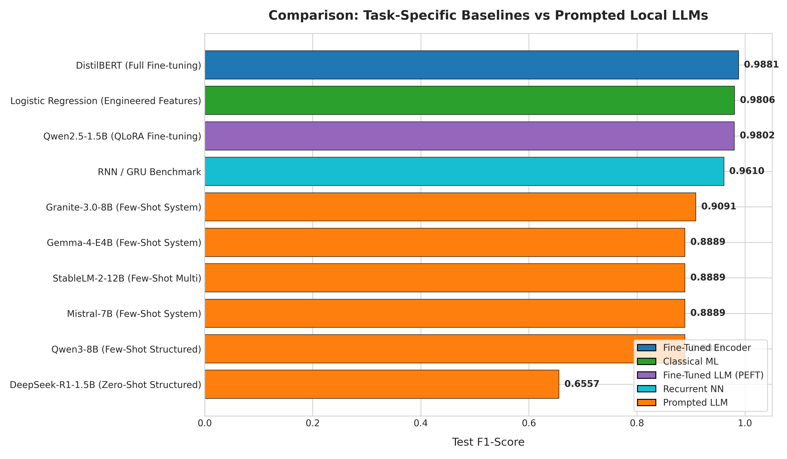
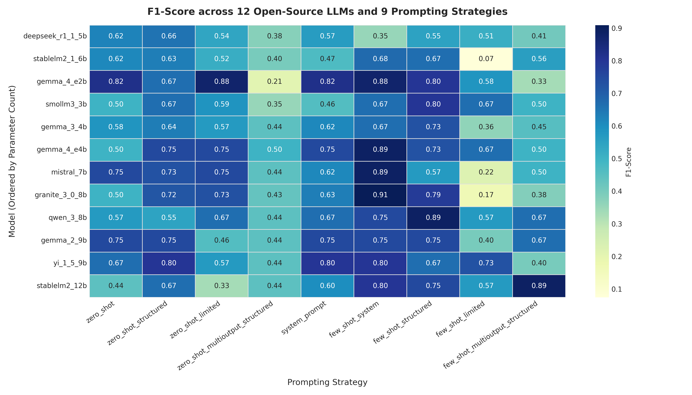
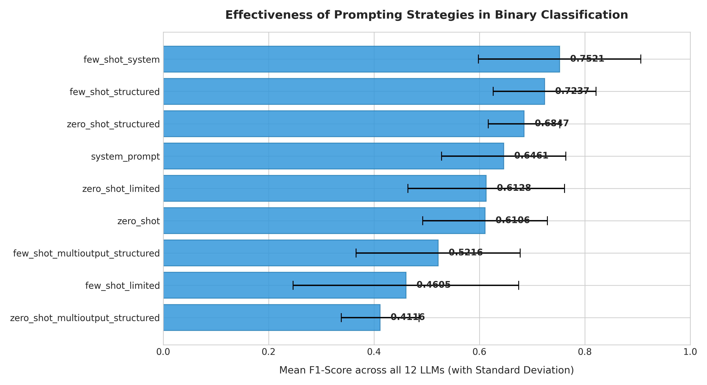
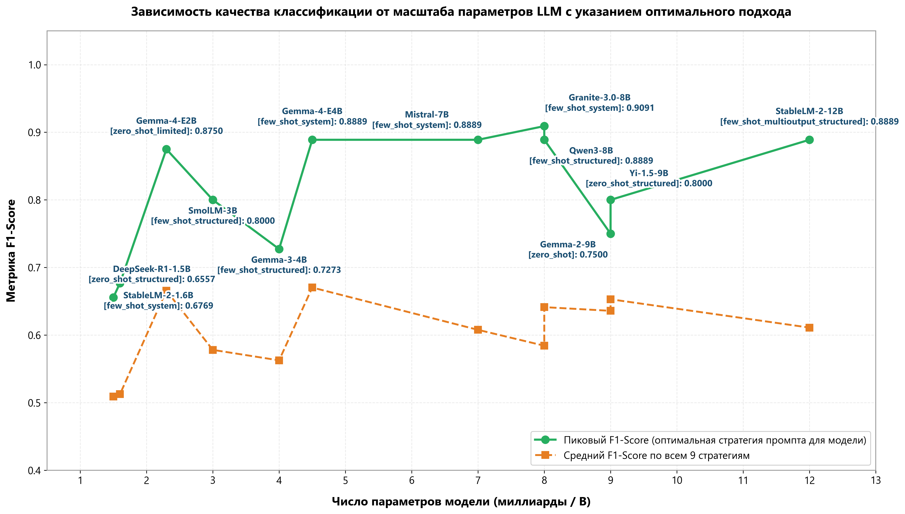
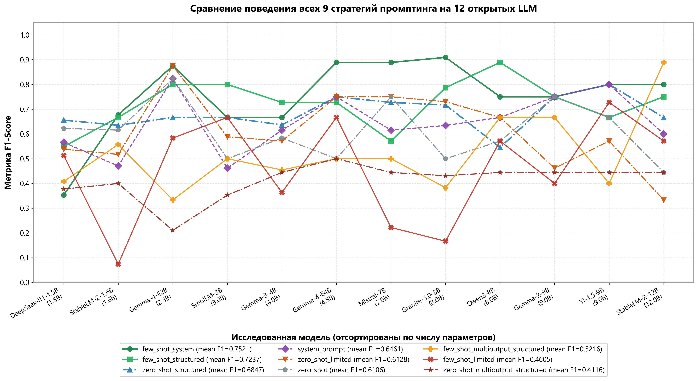
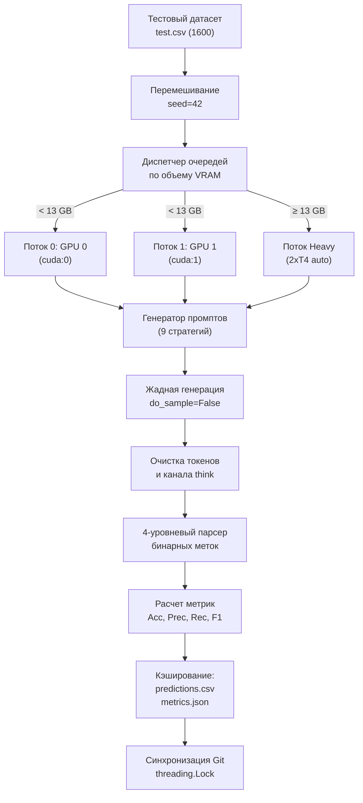

# Бенчмарк локальных LLM и базовых NLP-моделей в задаче классификации кликбейта

В этом исследовании я сосредоточился на экспериментальном анализе инференса открытых локальных языковых моделей (LLM) без дообучения: как открытые архитектуры масштаба от 1.5B до 12B параметров справляются с бинарной классификацией коротких текстов (кликбейтные заголовки против фактологических) при различных стратегиях формирования контекста и промпта. 

Для объективной оценки того, насколько zero-shot и few-shot инференс открытых LLM применим в продакшене, результаты сопоставляются с четырьмя эталонными решениями (бейзлайнами), подготовленными коллегами по команде: классическим ML на TF-IDF, рекуррентной сетью (RNN/GRU), дообученным энкодером DistilBERT и моделью Qwen2.5-1.5B с адаптерами QLoRA.

> **Разделение зон ответственности в проекте**:
> * **Моя работа**: проектирование и реализация бенчмарка инференса локальных LLM; разработка асинхронного двухпоточного планировщика очередей под 2x NVIDIA T4 GPU (`src/orchestrator.py`, `src/worker.py`, `src/model_loader.py`); реализация 9 стратегий промптинга (`src/prompts.py`); создание 4-уровневого парсера ответов с фильтрацией артефактов и каналов рассуждений `<think>` (`src/parsers.py`); проведение 108 экспериментов (12 моделей × 9 стратегий), сбор логов генераций и аналитическое сопоставление.
> * **Базовые референсные модели (работа команды)**: скрипты и метрики четырех базовых моделей (`src/baselines/`) подготовлены другими участниками команды в качестве эталонных ориентиров (верхней и нижней планок качества) для сравнения с исследуемым мной инференсом LLM.

Презентация проекта в формате PDF размещена в файле [`presentation/NLP_clickbait.pdf`](presentation/NLP_clickbait.pdf), а покадровые слайды — в каталоге [`presentation/slides/`](presentation/slides/).

---

## 1. Результаты экспериментов

### 1.1. Сводные результаты: сопоставление парадигм и всех 12 моделей

Для исключения неоднозначности результаты разделены на два уровня:
1. **Сравнение парадигм**: сопоставление внешних референсных моделей с обучением весов против ключевых контрольных точек инференса LLM.
2. **Полный срез по всем 12 исследованным LLM**: пиковая конфигурация промпта и средний результат для каждой протестированной модели без пропусков.

#### Таблица 1.1.1. Сравнение ключевых парадигм и классов моделей

| Парадигма / Класс модели | Архитектура / Метод | Число параметров | Тестовый размер | Accuracy | Precision | Recall | F1-Score |
|:---|:---|:---:|:---:|:---:|:---:|:---:|:---:|
| **Fine-Tuned Encoder (Команда)** | `distilbert-base-uncased` (Full Fine-tuning) | 66M | 1600 | **0.9881** | **0.9912** | 0.9850 | **0.9881** |
| **Classical ML (Команда)** | Logistic Regression + TF-IDF (word/char) + Heuristics | ~20K весов | 1600 | 0.9806 | 0.9824 | 0.9788 | 0.9806 |
| **Fine-Tuned LLM PEFT (Команда)**| `Qwen2.5-1.5B-Instruct` + QLoRA 4-bit | 1.5B (LoRA: 18M) | 200 | 0.9800 | 0.9706 | **0.9900** | 0.9802 |
| **Recurrent NN (Команда)** | RNN с двунаправленными GRU-ячейками | ~1.2M | 1600 | 0.9612 | 0.9683 | 0.9538 | 0.9610 |
| **Prompted LLM: Абсолютный пик (Мой бенчмарк)** | `granite-3.0-8b-instruct` (`few_shot_system`) | 8.0B | 50 | 0.9000 | 0.8333 | **1.0000** | 0.9091 |
| **Prompted LLM: Среднее топ-5 моделей на пике** | Granite-8B, Gemma-4-E4B, Mistral-7B, Qwen3-8B, StableLM-12B | 4.5B–12.0B | 10–50 | 0.9000 | 0.8067 | **1.0000** | 0.8929 |
| **Prompted LLM: Среднее по лучшей стратегии** | Среднее всех 12 моделей на `few_shot_system` | 1.5B–12.0B | 10–50 | 0.7433 | 0.6698 | 0.8846 | 0.7521 |
| **Prompted LLM: Среднее по базовой стратегии** | Среднее всех 12 моделей на `zero_shot` | 1.5B–12.0B | 10–50 | 0.6458 | 0.6265 | 0.6613 | 0.6106 |
| **Prompted LLM: Среднее по худшей стратегии** | Среднее всех 12 моделей на `zero_shot_multioutput` | 1.5B–12.0B | 10–50 | 0.4600 | 0.3871 | 0.4438 | 0.4116 |



#### Таблица 1.1.2. Пиковые и средние результаты для всех 12 протестированных LLM

В таблице ниже представлены индивидуальные результаты для **каждой из 12 моделей**, упорядоченные по возрастанию числа параметров: указана стратегия промптинга, обеспечившая наивысший $F_1$-score (пик), метрики матрицы ошибок и средний $F_1$-score по всем 9 опробованным стратегиям.

| Модель | Число параметров | Оптимальная стратегия (Пик) | Accuracy | Precision | Recall | Пиковый F1 | Средний F1 (по 9 стратегиям) |
|:---|:---:|:---|:---:|:---:|:---:|:---:|:---:|
| `deepseek_r1_1_5b` | 1.5B | `zero_shot_structured` | 0.5800 | 0.5556 | 0.8000 | **0.6557** | 0.5092 |
| `stablelm2_1_6b` | 1.6B | `few_shot_system` | 0.5800 | 0.5500 | 0.8800 | **0.6769** | 0.5126 |
| `gemma_4_e2b` | 2.3B | `zero_shot_limited` | 0.9000 | 0.8750 | 0.8750 | **0.8750** | 0.6657 |
| `smollm3_3b` | 3.0B | `few_shot_structured` | 0.8000 | 0.6667 | **1.0000** | **0.8000** | 0.5781 |
| `gemma_3_4b` | 4.0B | `few_shot_structured` | 0.7000 | 0.5714 | **1.0000** | **0.7273** | 0.5626 |
| `gemma_4_e4b` | 4.5B | `few_shot_system` | 0.9000 | 0.8000 | **1.0000** | **0.8889** | 0.6703 |
| `mistral_7b` | 7.0B | `few_shot_system` | 0.9000 | 0.8000 | **1.0000** | **0.8889** | 0.6077 |
| `granite_3_0_8b` | 8.0B | `few_shot_system` | 0.9000 | 0.8333 | **1.0000** | **0.9091** | 0.5843 |
| `qwen_3_8b` | 8.0B | `few_shot_structured` | 0.9000 | 0.8000 | **1.0000** | **0.8889** | 0.6413 |
| `gemma_2_9b` | 9.0B | `zero_shot` | 0.8000 | 0.7500 | 0.7500 | **0.7500** | 0.6358 |
| `yi_1_5_9b` | 9.0B | `zero_shot_structured` | 0.8000 | 0.6667 | **1.0000** | **0.8000** | 0.6529 |
| `stablelm2_12b` | 12.0B | `few_shot_multioutput_structured` | 0.9000 | 0.8000 | **1.0000** | **0.8889** | 0.6110 |

---

### 1.2. Матрица F1-Score: 12 моделей × 9 стратегий промптинга

В ячейках указан точный $F_1$-score классификации кликбейта для каждой комбинации.

| Модель | Параметры | zero_shot | zero_shot_structured | zero_shot_limited | zero_shot_multi | system_prompt | few_shot_system | few_shot_structured | few_shot_limited | few_shot_multi | Средний F1 |
|:---|:---:|:---:|:---:|:---:|:---:|:---:|:---:|:---:|:---:|:---:|:---:|
| `deepseek_r1_1_5b` | 1.5B | 0.6222 | 0.6557 | 0.5385 | 0.3774 | 0.5660 | 0.3529 | 0.5490 | 0.5128 | 0.4082 | **0.5092** |
| `stablelm2_1_6b` | 1.6B | 0.6154 | 0.6349 | 0.5172 | 0.4000 | 0.4706 | 0.6769 | 0.6667 | 0.0741 | 0.5574 | **0.5126** |
| `gemma_4_e2b` | 2.3B | 0.8235 | 0.6667 | 0.8750 | 0.2105 | 0.8235 | 0.8750 | 0.8000 | 0.5833 | 0.3333 | **0.6657** |
| `smollm3_3b` | 3.0B | 0.5000 | 0.6667 | 0.5882 | 0.3529 | 0.4615 | 0.6667 | 0.8000 | 0.6667 | 0.5000 | **0.5781** |
| `gemma_3_4b` | 4.0B | 0.5833 | 0.6364 | 0.5714 | 0.4444 | 0.6154 | 0.6667 | 0.7273 | 0.3636 | 0.4545 | **0.5626** |
| `gemma_4_e4b` | 4.5B | 0.5000 | 0.7500 | 0.7500 | 0.5000 | 0.7500 | 0.8889 | 0.7273 | 0.6667 | 0.5000 | **0.6703** |
| `mistral_7b` | 7.0B | 0.7500 | 0.7273 | 0.7500 | 0.4444 | 0.6154 | 0.8889 | 0.5714 | 0.2222 | 0.5000 | **0.6077** |
| `granite_3_0_8b` | 8.0B | 0.5000 | 0.7170 | 0.7302 | 0.4314 | 0.6341 | **0.9091** | 0.7869 | 0.1667 | 0.3830 | **0.5843** |
| `qwen_3_8b` | 8.0B | 0.5714 | 0.5455 | 0.6667 | 0.4444 | 0.6667 | 0.7500 | 0.8889 | 0.5714 | 0.6667 | **0.6413** |
| `gemma_2_9b` | 9.0B | 0.7500 | 0.7500 | 0.4615 | 0.4444 | 0.7500 | 0.7500 | 0.7500 | 0.4000 | 0.6667 | **0.6358** |
| `yi_1_5_9b` | 9.0B | 0.6667 | 0.8000 | 0.5714 | 0.4444 | 0.8000 | 0.8000 | 0.6667 | 0.7273 | 0.4000 | **0.6529** |
| `stablelm2_12b` | 12.0B | 0.4444 | 0.6667 | 0.3333 | 0.4444 | 0.6000 | 0.8000 | 0.7500 | 0.5714 | 0.8889 | **0.6110** |



---

### 1.3. Анализ эффективности стратегий формирования промпта

Я сгруппировал результаты по 9 стратегиям и рассчитал средний $F_1$-score и стандартное отклонение по всем 12 моделям:

1. **`few_shot_system`**: Mean $F_1 = \mathbf{0.7521}$ ($\sigma = 0.1583$)
   Формат: системный промпт с ролью эксперта + 2 примера диалога (кликбейт и не-кликбейт). Дал максимальную метрику для 5 из 12 моделей (`granite_3_0_8b`, `mistral_7b`, `gemma_4_e4b`, `gemma_4_e2b`, `yi_1_5_9b`).
2. **`few_shot_structured`**: Mean $F_1 = \mathbf{0.7237}$ ($\sigma = 0.1009$)
   Формат: системный промпт + 2 примера в формате строгого JSON `{"clickbait": 0/1}`. Показал наивысшую стабильность среди моделей (минимальная дисперсия).
3. **`zero_shot_structured`**: Mean $F_1 = \mathbf{0.6847}$ ($\sigma = 0.0718$)
   Формат: единичный запрос без примеров с требованием вывода строгого JSON. Повысил качество относительно базового zero-shot на $+7.41$ п.п.
4. **`system_prompt`**: Mean $F_1 = \mathbf{0.6461}$ ($\sigma = 0.1197$)
   Формат: инструкция эксперта в роли `system`, заголовок в роли `user`.
5. **`zero_shot_limited`**: Mean $F_1 = \mathbf{0.6128}$ ($\sigma = 0.1578$)
   Формат: требование выдать строго один символ (`1` или `0`) без дополнительных слов.
6. **`zero_shot`**: Mean $F_1 = \mathbf{0.6106}$ ($\sigma = 0.1258$)
   Формат: базовый вопрос без спецификации системной роли и примеров.
7. **`few_shot_multioutput_structured`**: Mean $F_1 = \mathbf{0.5216}$ ($\sigma = 0.1554$)
   Формат: передача батча из нескольких заголовков с демонстрационным батчем и требованием вернуть JSON-массив `{"predictions": [...]}`.
8. **`few_shot_limited`**: Mean $F_1 = \mathbf{0.4605}$ ($\sigma = 0.2227$)
   Формат: диалоговые примеры с ответами `1` и `0` без жесткой разметки ролей. Часть моделей деградировала до ответов не по формату.
9. **`zero_shot_multioutput_structured`**: Mean $F_1 = \mathbf{0.4116}$ ($\sigma = 0.0768$)
   Худшая стратегия. Без примеров батчевого вывода модели теряют соответствие индексов в массиве либо галлюцинируют списки неверной длины.



---

### 1.4. Зависимость метрик от размера модели и динамика стратегий

#### 1.4.1. Пиковое и среднее качество в зависимости от числа параметров

На графике ниже сопоставлены пиковый $F_1$-score (с указанием наименования оптимальной стратегии для каждой точки) и средний $F_1$-score по всем 9 стратегиям:



* **Компактные модели демонстрируют паритет с тяжелыми при точечном подборе промпта**: `gemma_4_e2b` (2.3B параметров) достигла пикового $F_1 = 0.8750$ на стратегии `zero_shot_limited`, в то время как 12B модель `stablelm2_12b` на своей лучшей стратегии (`few_shot_multioutput_structured`) показала $F_1 = 0.8889$.
* **Средняя стабильность архитектур**: по среднему $F_1$ среди всех 9 стратегий лидируют `gemma_4_e4b` (4.5B, Mean $F_1 = 0.6703$), `gemma_4_e2b` (2.3B, Mean $F_1 = 0.6657$) и `yi_1_5_9b` (9.0B, Mean $F_1 = 0.6529$).
* **Модели рассуждений (Reasoning LLM: `deepseek_r1_1_5b`)**: в zero-shot классификации модель показала пиковый $F_1 = 0.6557$ на `zero_shot_structured` исключительно при жестком ограничении бюджета рассуждений. Без директивы краткости фаза `<think>` исчерпывала весь лимит `max_new_tokens = 512`, обрывая генерацию до выдачи ответа.

#### 1.4.2. Поведение каждой из 9 стратегий промптинга на всем спектре моделей

Для детального анализа чувствительности архитектур я построил отдельный график с индивидуальными траекториями для всех 9 исследованных стратегий:



Анализ кривых выявляет ключевые закономерности:
1. **`few_shot_system` (mean $F_1 = 0.7521$) и `few_shot_structured` (mean $F_1 = 0.7237$)**: формируют верхнюю границу качества для всех классов моделей от 1.5B до 12B. Начиная с масштаба 4.5B обе стратегии стабильно удерживают $F_1 \ge 0.72$, достигая глобального максимума $0.9091$ на `granite_3_0_8b`.
2. **Аномальная деградация `few_shot_limited` (красная линия)**: стратегия демонстрирует критические провалы на строгих моделях с развитым instruction-following — падение до $F_1 = 0.0741$ на `stablelm2_1_6b` и до $F_1 = 0.1667$ на `granite_3_0_8b`. Причина: отсутствие явных ролевых разделителей (`user`/`assistant`) провоцировало модель на продолжение диалога с генерацией фиктивных реплик вместо выдачи одиночной цифры.
3. **Хроническая неприменимость zero-shot батчинга (`zero_shot_multioutput_structured`, темно-коричневая линия)**: проходит по нижней границе всего бенчмарка ($F_1 \in [0.21, 0.50]$). Ни одна модель до 13B параметров не смогла надежно сопоставить индексы элементов входного батча без обучающих примеров.
4. **Устойчивость структурированного вывода (`zero_shot_structured`, синяя линия)**: показывает наименьшую дисперсию среди zero-shot подходов ($\sigma = 0.0679$), удерживая качество в коридоре $0.55\text{--}0.80$ даже на малых моделях 1.5B–3.0B.

---

### 1.5. Ключевые выводы

1. **Специализированная модель превосходит промптинг LLM общего назначения.**
   Полносвязный DistilBERT (66M параметров) достиг тестового $F_1 = 0.9881$, а классическая логистическая регрессия с TF-IDF и эвристиками — $F_1 = 0.9806$. Лучший результат среди всех 108 экспериментов с промптингом LLM составил $F_1 = 0.9091$ (Granite-3.0-8B). Разрыв в пользу fine-tuning составляет $+7.90$ п.п.
2. **Дообучение методом QLoRA на порядки сокращает разрыв.**
   Настройка адаптеров LoRA на модели `Qwen2.5-1.5B-Instruct` позволила получить тестовый $F_1 = 0.9802$ и Accuracy $= 0.9800$, что сопоставимо с DistilBERT при обучении только 18M адаптивных параметров в 4-битном квантовании.
3. **Промптинг с системной ролью и примерами обязателен для стабильной классификации.**
   Переход от `zero_shot` к `few_shot_system` поднимает средний $F_1$-score по всем моделям с $0.6106$ до $0.7521$ ($+14.15$ п.п.).
4. **Батчинг через генерацию списков в одном промпте (`multioutput`) неэффективен.**
   Попытка сэкономить количество вызовов модели путем передачи списка заголовков и запроса массива `{"predictions": [...]}` приводит к падению среднего качества до $0.4116$ в zero-shot и $0.5216$ в few-shot из-за рассинхронизации порядка элементов и пропусков токенов.

---

## 2. Технические подробности реализации

### 2.1. Данные и задача

Задача: бинарная классификация новостных заголовков на английском языке:
* Класс `1`: кликбейтный заголовок (сенсационность, сокрытие ключевой информации, манипуляция эмоциями).
* Класс `0`: фактологический заголовок.

Датасет: `kvdep1/clickbait-dataset-split` объемом **32 000 примеров** с фиксированным разбиением:
* **Train**: 28 800 примеров (90%)
* **Validation**: 1 600 примеров (5%)
* **Test**: 1 600 примеров (5%)

Классы сбалансированы: 50% кликбейта и 50% не-кликбейта.

Распределение длины заголовков:
* Обычные заголовки имеют пик длины в диапазоне 7–9 слов (40–60 символов).
* Кликбейтные заголовки имеют смещение в сторону большей длины — 10–14 слов (60–90 символов).

---

### 2.2. Математические определения метрик

Для каждого эксперимента регистрировались четыре базовые величины матрицы ошибок:
* $\text{TP}$ (True Positive) — кликбейт, верно классифицированный как кликбейт.
* $\text{TN}$ (True Negative) — обычный заголовок, верно классифицированный как обычный.
* $\text{FP}$ (False Positive) — обычный заголовок, ошибочно определенный как кликбейт.
* $\text{FN}$ (False Negative) — кликбейт, ошибочно определенный как обычный заголовок.

Метрики качества вычислялись по формулам:

$$\text{Accuracy} = \frac{\text{TP} + \text{TN}}{\text{TP} + \text{TN} + \text{FP} + \text{FN}}$$

$$\text{Precision} = \frac{\text{TP}}{\text{TP} + \text{FP}}$$

$$\text{Recall} = \frac{\text{TP}}{\text{TP} + \text{FN}}$$

$$F_1 = 2 \cdot \frac{\text{Precision} \cdot \text{Recall}}{\text{Precision} + \text{Recall}} = \frac{2\text{TP}}{2\text{TP} + \text{FP} + \text{FN}}$$

---

### 2.3. Внешние референсные решения команды (Baselines)

Для объективной оценки того, насколько zero-shot и few-shot инференс нетренированных локальных LLM конкурентоспособен, в проект включены четыре референсные модели, подготовленные коллегами по команде. Они служат верхней и нижней планками качества для задачи бинарной классификации кликбейта:

#### 1. Классический ML (`src/baselines/classical_ml.py`)
* **Векторизация текстов**:
  * Word-level TF-IDF: униграммы и биграммы ($n \in [1, 2]$), 10 000 признаков.
  * Char-level TF-IDF: символьные n-граммы ($n \in [2, 5]$), 10 000 признаков.
* **Сентимент и удобочитаемость**:
  * Полярность и субъективность по TextBlob и VADER.
  * Индекс удобочитаемости Флеша (Flesch Reading Ease):
    $$\text{FRE} = 206.835 - 1.015 \left(\frac{\text{words}}{\text{sentences}}\right) - 84.6 \left(\frac{\text{syllables}}{\text{words}}\right)$$
  * Уровень сложности Флеша-Кинкейда (Flesch-Kincaid Grade Level):
    $$\text{FKGL} = 0.39 \left(\frac{\text{words}}{\text{sentences}}\right) + 11.8 \left(\frac{\text{syllables}}{\text{words}}\right) - 15.59$$
* **Специфические эвристики**:
  * Доля символов верхнего регистра:
    $$\text{UpperCharRatio} = \frac{N_{\text{upper}}}{N_{\text{chars}}}$$
  * Доля слов, полностью набранных капсом:
    $$\text{UpperWordRatio} = \frac{N_{\text{caps}}}{N_{\text{words}}}$$
  * Частота вхождения цифр, восклицательных и вопросительных знаков.
* **Классификатор**: `LogisticRegression(C=1.0, max_iter=1000)`.
* **Результаты**:
  * Train+Val (30 400 примеров): $F_1 = 0.9909$ ($\text{TN}=15063, \text{FP}=138, \text{FN}=138, \text{TP}=15061$).
  * Test (1 600 примеров): $F_1 = 0.9806$, Accuracy $= 0.9806$ ($\text{TN}=786, \text{FP}=14, \text{FN}=17, \text{TP}=783$).

#### 2. Рекуррентная сеть RNN / GRU
* Архитектура: эмбеддинг-слой + двунаправленный GRU + полносвязный классификатор.
* Обучение: 6 эпох, падение функции потерь cross-entropy с $0.32$ до $0.20$.
* Test (1 600 примеров): Accuracy $= 0.9612$, $F_1 = 0.9610$ ($\text{TN}=775, \text{FP}=25, \text{FN}=37, \text{TP}=763$).

#### 3. Дистиллированный энкодер DistilBERT (`src/baselines/distilbert_baseline.py`)
* Модель: `distilbert/distilbert-base-uncased` (6 слоев, 768 скрытая размерность, 12 голов внимания).
* Обучение: Hugging Face `Trainer`, cross-entropy loss, learning rate $2 \cdot 10^{-5}$, batch size 32.
* Test (1 600 примеров): Accuracy $= 0.9881$, Precision $= 0.9912$, Recall $= 0.9850$, $F_1 = 0.9881$ ($\text{TN}=793, \text{FP}=7, \text{FN}=12, \text{TP}=788$).
* **Explainable AI (XAI)**: реализован расчет атрибуции токенов методом Integrated Gradients. Метод сопоставляет каждому слову градиент предсказанного логита по входным эмбеддингам, позволяя интерпретировать, какие именно лексемы определяют решение о кликбейтности.

#### 4. Дообучение LLM методом QLoRA (`src/baselines/qlora_llm.py`)
* Базовая модель: `Qwen/Qwen2.5-1.5B-Instruct`.
* Квантование: 4-bit NormalFloat (NF4) через `bitsandbytes`, тип вычислений `torch.float16`, двойное квантование.
* LoRA параметры: ранг $r = 16$, коэффициент масштабирования $\alpha = 32$, dropout $= 0.05$. Целевые матрицы: `q_proj`, `k_proj`, `v_proj`, `o_proj`.
* Метрики на валидации (шаг 110): $\text{Loss} = 0.00349$, $\text{Accuracy} = 0.9981$, $F_1 = 0.9981$.
* Test (200 примеров): Accuracy $= 0.9800$, Precision $= 0.9706$, Recall $= 0.9900$, $F_1 = 0.9802$ ($\text{TN}=97, \text{FP}=3, \text{FN}=1, \text{TP}=99$).

---

### 2.4. Архитектура инференс-конвейера локальных LLM

Для проведения 108 экспериментов я разработал асинхронный отказоустойчивый конвейер (`src/orchestrator.py`, `src/worker.py`), оптимизированный под 2x NVIDIA T4 GPU (Kaggle Environment).



Инженерные решения конвейера:

1. **Многопоточное распределение нагрузки по GPU**:
   * Модели весом менее 13 ГБ сортируются по объему и поочередно распределяются в два независимых потока `threading.Thread`, привязанных к устройствам `cuda:0` и `cuda:1`.
   * Модели весом $\ge 13$ ГБ (`stablelm2_12b`, `mistral_7b`, `codestral_22b`) помещаются в тяжелую очередь и запускаются последовательно после завершения легких потоков с параметром `device_map="auto"` (тензорное распараллеливание на обе карты).
2. **Динамическое квантование и выбор точности**:
   * Для моделей крупнее 4B применяется квантование 4-bit NF4 (`BitsAndBytesConfig(load_in_4bit=True)`).
   * Для моделей Google Gemma 3 и Gemma 4 принудительно используется тип `torch.bfloat16`, так как вычисления в `float16` на тензорных ядрах T4 приводят к переполнению диапазона и генерации пустых токенов.
3. **Самовосстанавливающаяся компиляция промптов (Self-Healing Prompt Compilation)**:
   * Токенизаторы моделей семейства Gemma 2 вызывают исключение при наличии сообщений с `role: "system"`. Конвейер перехватывает данную ошибку и объединяет системную инструкцию в первое пользовательское сообщение (`merge_system_prompt_to_user`).
   * Для мультимодальных процессоров (`AutoProcessor` в Gemma 3/4) текстовый ввод преобразуется в типизированный словарь `[{'type': 'text', 'text': ...}]`.
4. **Контроль бюджета рассуждений для Reasoning LLM**:
   * Модели `deepseek-ai/DeepSeek-R1-Distill-Qwen-1.5B` и `Qwen/Qwen3-8B` имеют встроенную генерацию цепочки мыслей. Чтобы предотвратить переполнение выходного окна, в промпт перед префиксом ответа встраивается инструкция:
     `Note: Think extremely concisely (under 2-3 sentences max) before outputting the final Answer.`
   * Модуль парсинга (`clean_generation_text`) вырезает теги `<think>...</think>`, `<|channel|>thought` и служебные маркеры.
5. **Четырехуровневый парсер извлечения меток**:
   * **Уровень 1**: Регулярное выражение строгого JSON: `r'\{\s*"clickbait"\s*:\s*([01])\s*\}'`.
   * **Уровень 2**: Поиск ключевых слов: `r'(?:answer|prediction|label|clickbait)\s*:\s*([01])'`.
   * **Уровень 3**: Удаление артефактов из формулировки самого промпта (например, строк `"1 or 0"`, `"1 for clickbait"`) и извлечение изолированных цифр `\b([01])\b`.
   * **Уровень 4**: Обратное сканирование текста с конца до первой цифры `0` или `1`.
6. **Управление дисковым пространством и VRAM**:
   * После завершения каждого эксперимента выполняются `del model`, `del tk`, `gc.collect()` и `torch.cuda.empty_cache()`.
   * Для предотвращения переполнения диска Kaggle (лимит 20 ГБ) веса отработавшей модели автоматически удаляются из кэша `~/.cache/huggingface/hub` функцией `shutil.rmtree`.
7. **Идемпотентность и восстановление контрольных точек**:
   * Перед запуском генерации воркер проверяет наличие `predictions.csv`. Если предсказания для всех строк уже получены, расчет пропускается, а метрики загружаются из кэша.

---

## 3. Структура репозитория

```text
├── assets/
│   └── plots/                           # Сгенерированные графики публикационного качества (300 DPI)
│       ├── baselines_vs_prompting.png   # Сравнение baselines и LLM
│       ├── f1_score_heatmap.png         # Тепловая карта 12 моделей x 9 стратегий
│       ├── model_scaling_comparison.png # График зависимости метрик от масштаба параметров
│       └── prompt_strategies_comparison.png # Ранжирование 9 стратегий промптинга
├── data/
│   └── test.csv                         # Пример тестовой выборки заголовков с разметкой
├── experiments/                         # Результаты всех 108 экспериментов (predictions.csv, metrics.json)
│   ├── deepseek_r1_1_5b/
│   ├── gemma_2_9b/
│   ├── gemma_3_4b/
│   ├── gemma_4_e2b/
│   ├── gemma_4_e4b/
│   ├── granite_3_0_8b/
│   ├── mistral_7b/
│   ├── qwen_3_8b/
│   ├── smollm3_3b/
│   ├── stablelm2_12b/
│   ├── stablelm2_1_6b/
│   └── yi_1_5_9b/
├── notebooks/
│   └── nlp_clickbait_prompting_kaggle.ipynb # Исходный интерактивный блокнот для Kaggle 2xT4
├── presentation/
│   ├── NLP_clickbait.pdf                # Полная презентация проекта в PDF
│   └── slides/                          # Покадровые слайды презентации (slide_01 .. slide_12)
├── results/
│   ├── benchmark_summary_all_models.csv # Полная сводная таблица 108 экспериментов
│   ├── few_shot_limited_summary_metrics.csv
│   ├── few_shot_multioutput_structured_summary_metrics.csv
│   ├── few_shot_structured_summary_metrics.csv
│   ├── few_shot_system_summary_metrics.csv
│   ├── system_prompt_summary_metrics.csv
│   ├── zero_shot_limited_summary_metrics.csv
│   ├── zero_shot_multioutput_structured_summary_metrics.csv
│   ├── zero_shot_structured_summary_metrics.csv
│   └── zero_shot_summary_metrics.csv
├── src/                                 # Модульный Python-пакет
│   ├── baselines/
│   │   ├── __init__.py
│   │   ├── classical_ml.py              # Логистическая регрессия + TF-IDF + эвристики
│   │   ├── distilbert_baseline.py       # Fine-tuning DistilBERT + Explainable AI (Captum)
│   │   └── qlora_llm.py                 # Пайплайн QLoRA для Qwen2.5-1.5B
│   ├── __init__.py
│   ├── config.py                        # Реестр 12 моделей, гиперпараметры, типы экспериментов
│   ├── metrics.py                       # Вычисление метрик (Accuracy, Precision, Recall, F1)
│   ├── model_loader.py                  # Загрузка весов, квантование, очистка памяти
│   ├── orchestrator.py                  # Двухпоточный планировщик 2x GPU
│   ├── parsers.py                       # Очистка вывода и 4-уровневый парсер меток
│   ├── prompts.py                       # Генератор 9 структур промптов и адаптеры шаблонов
│   └── worker.py                        # Изолированный воркер инференса на GPU
├── .gitignore
├── requirements.txt                     # Зависимости проекта
└── run_benchmark.py                     # CLI-скрипт запуска бенчмарка
```

---

## 4. Воспроизведение и запуск

### 4.1. Установка окружения

```bash
git clone https://github.com/kvdep/Testing-local-LLMS-on-classification-tasks.git
cd Testing-local-LLMS-on-classification-tasks
pip install -r requirements.txt
```

### 4.2. Запуск классического бейзлайна

```bash
python run_benchmark.py --run-classical-baseline --train-data-path data/train.csv --data-path data/test.csv
```

### 4.3. Запуск инференса LLM на выбранных моделях

```bash
# Запуск для конкретных моделей и стратегий
python run_benchmark.py \
  --models gemma_4_e2b granite_3_0_8b \
  --strategies zero_shot few_shot_system few_shot_structured \
  --device-mode dual-gpu \
  --data-path data/test.csv
```

### 4.4. Доступ к Hugging Face Hub (для закрытых моделей)

Для загрузки моделей с закрытыми весами (например, семейства Gemma или Llama) задайте токен:

```bash
export HF_TOKEN="ваш_токен_huggingface"  # Linux / macOS
$env:HF_TOKEN="ваш_токен_huggingface"   # Windows PowerShell
```
